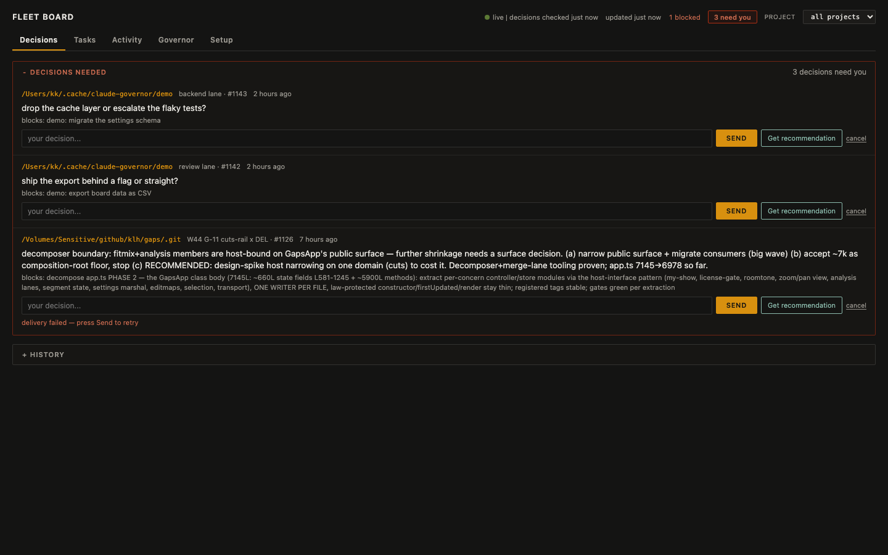

# suspenders

[](https://github.com/klh/suspenders/actions/workflows/ci.yml)
[](https://klh.github.io/suspenders/)

**A control plane and dashboard for fleets of Claude Code sessions.** Run several agents in parallel on one codebase: suspenders tracks who is working on what, refuses conflicting edits, detects dead agents, and puts every question an agent raises on a web board where you can answer it.

Built on a SQLite database (sessions, claims, locks, events, work graph) wired into Claude Code's hook system, plus a live board that shows fleet state at one-second resolution.



## What problem does it solve

- **Agents die** — usage cliffs, crashes, context compaction. Suspenders notices: a session is flagged zombie only when both its heartbeat and its transcript are stale, and nothing is reclaimed without a human decision.
- **Agents collide** — two sessions editing the same file. File leases and scope claims make the second writer wait or get refused; work items can declare required capabilities that a session must advertise before claiming.
- **Questions get lost** — an agent asks something and keeps waiting in the dark. Questions surface as decisions on the board with the asking agent, the task they block, and an optional LLM recommendation you can accept or edit.
- **Knowledge evaporates** — the same question gets answered twice, and the second asker waits on a busy expert anyway. Every answered consult becomes a searchable problem→solution pair; a repeat question resolves instantly, with provenance showing which agent solved it and whether that agent is still running.
- **State lives in chat logs** — suspenders keeps task state in a per-project work graph backed by SQLite, so any session (or a restarted one) sees the same queue, claims, and history.

## Install

Requires [Bun](https://bun.sh) ≥ 1.1 and Claude Code.

```bash
git clone https://github.com/klh/suspenders && cd suspenders
./install.sh --wire              # + --with-launchd for the macOS agents
```

The installer is idempotent and namespaced (everything under `~/.claude/hooks/suspenders/`), merges hook wiring per-event without clobbering existing registrations, and prints next steps. Restart Claude Code; then:

```bash
bun ~/.claude/hooks/suspenders/bin/fleet-board.ts           # live board → http://127.0.0.1:7799
bun ~/.claude/hooks/suspenders/bin/fleet-board.ts --demo    # same board on seeded demo data — try before wiring
bun ~/.claude/hooks/suspenders/bin/work.ts ready            # dispatchable work, per project
bun ~/.claude/hooks/suspenders/bin/monitor.ts               # fleet health (--fix applies safe repairs)
```

Every CLI is also usable from scripts — the board's answer box and the monitor are thin wrappers over the same commands.

## Components

| Surface | What it does |
|---|---|
| **Control plane** (`lib/govdb.ts`) | SQLite/WAL — sessions, claims, locks, events, facts, cursors, work graph; one database serves every repo, partitioned per project |
| **Hook gates** (`gate.ts`) | One entrypoint: secrets gate (gitleaks + inline detection, `cd`-aware), edit-enforce, file-lease governor, mutation-size cap (denies >40-line raw mutations on existing files; `SUSPENDERS_MAX_MUTATION`), operational-ledger marker guard (no new TODO/IN-FLIGHT/BLOCKED/NEXT markers in ledgers), config guard, claim-done stop gate — the Edit/Write gates chain in one process |
| **Work graph** (`bin/work.ts`) | `add / split / take / done / ready / mine / orphaned / reclaim / release / migrate-ledger` — compare-and-swap claims, dependency gating, capability requirements; splits beyond 2 children must reference a registered plan item; `migrate-ledger` ingests a Markdown ledger's unresolved items into the graph (deduped, idempotent, tombstones the ledger) |
| **Coordination bus** (`bin/coord.ts`) | bootstrap, inbox, emit, wait, pause/resume with continuation capsules, consults, facts, broadcasts, `lease-release`, `metrics` (per-item wall vs agent time, lane dwell, friction — daily snapshot facts for trend diffing) |
| **Consult knowledge base** (`coord kb`) | `consult-reply` harvests every answered consult as a (problem, solution) pair (FTS5); a new consult resolves against the store **before** routing to a live expert — the asker gets the stored solution instantly, with provenance and an `--no-kb` escape hatch. `kb stats\|search\|list` |
| **Fleet board** (`bin/fleet-board.ts`) | Live dashboard — Decisions / Tasks / Activity / Governor / Setup views, project filter, task drawer, decision history; `--demo` seeds example data. Write endpoints for answering decisions, dismissing, and requesting recommendations (`/api/advise` → `bin/advise.ts`) |
| **Advice worker** (`bin/advise.ts`) | An LLM (any OpenAI-compatible API; model autodiscovered from `/v1/models`) reads the decision with control-plane context and writes a recommendation the human can accept, edit, or ignore |
| **Monitor** (`bin/monitor.ts`) | Read-only health; `--fix` sweeps stale sessions and locks; three-state verdicts (ZOMBIE / SUSPECT / UNKNOWN); alerts the coordinator |
| **Usage windows** (`bin/quota-window.ts`) | Remembers observed 429 resets and predicts the next 5-hour cliff: exit 0 safe / 1 near cliff / 2 unknown |
| **Progress protocol** (`bin/progress.ts`) | Small file-based progress bar; the statusline aggregates it; doubles as the lane-level heartbeat |
| **macOS agents** (`hooks/launchd/`) | 15-min fleet monitor + LLM keepwarm |

## Architecture

```
Claude Code sessions (n)
  │ SessionStart → register session, capabilities, transcript_path
  │ PreToolUse   → secrets / edit-enforce / file-lease gates
  │ PostToolUse  → syntax check, md format
  │ Stop         → claim-done gate
  ▼
governor.db (SQLite/WAL, ~/.cache/claude-governor/)
  ├── sessions   identity, role, parent, caps, transcript_path, hb
  ├── claims     scope leases + intents
  ├── work_items the work graph — per-project partition
  ├── events     every event kind, incl. NEED_DECISION / ANSWER / ADVICE
  ├── facts      latest-value store (advice, zombie flags, coordinator id…)
  └── locks      short-lived file leases
  ▲ 1s poll (WAL = concurrent readers)
fleet board — decisions · tasks · activity · governor · setup
```

Decision flow: a lane emits `NEED_DECISION` → the board lists it with the task it blocks → optionally `advise.ts` asks your configured LLM for a recommendation → the human edits and sends → the lane receives the `ANSWER` event on its next poll and continues.

### Messaging and consults

```mermaid
sequenceDiagram
    autonumber
    participant L as Lane (worker session)
    participant C as Coordinator session
    participant G as governor.db
    participant B as Fleet board (browser)
    participant A as advise.ts (LLM worker)
    participant H as Human operator

    L->>G: work take W7 (claim, capability-checked)
    L->>G: emit checkpoint --sha
    L->>G: emit NEED_DECISION --note "queue vs stream?"

    G->>B: 1s poll → decision card
    B->>H: "2 decisions need you"

    alt human wants a recommendation
        H->>B: click "Get recommendation"
        B->>A: POST /api/advise (spawn, detached)
        A->>G: read claims, recent events, work items
        A->>A: LLM call (OpenAI-compatible, model autodiscovered)
        A->>G: fact advice.<id> + ADVICE event
        G->>B: recommendation renders on the card
        B->>H: "use" fills the answer field
    end

    H->>B: edit answer, click send
    B->>G: emit ANSWER --to <lane> --note "…"
    G->>L: lane inbox sees ANSWER on next poll

    L->>G: coord who-knows "retry contracts?"
    G->>C: consult C## — "? C## from <lane>"
    C->>G: coord consult-reply C## "<answer>"
    G->>L: answer lands in lane inbox

    Note over G,H: stale heartbeat + stale transcript → zombie alert; nothing is reclaimed without a human
    G->>B: zombie chip
    H->>G: work reclaim W7 → re-dispatch at the frozen transcript
```

## Examples

A worked session — bootstrap, register work, capability-gated dispatch, consult, decision with recommendation, answer, zombie reclaim — lives in [examples/walkthrough.md](examples/walkthrough.md). Every command is copy-pasteable against any repo.

## Security

- The database stores no credentials; the secrets gate scans every Bash call (gitleaks + inline detection) before execution, repo-scoped even across `cd` boundaries.
- The board binds to 127.0.0.1 only. LAN exposure is opt-in via `SUSPENDERS_BIND=0.0.0.0` (for example to reach it as `suspenders.local` behind a local reverse proxy). Write endpoints require a same-origin request from a browser, or a loopback Host for CLI clients.
- `advise.ts` sends decision text and control-plane metadata to the LLM endpoint you configure (local by default). Point `SUSPENDERS_LLM_URL` at a cloud API only if that content may leave the machine.

## Docs

- [Coordination protocol](docs/coordination-protocol.md) — a copy-paste CLAUDE.md section for a multi-agent repo: reporting discipline, integration steps, pause/resume, capability dispatch, zombie policy, usage windows.

## Status

In use for months on a multi-repo fleet (macOS + Bun + Claude Code); schema v4. Extracted from the
[speedy-claude](https://github.com/klh/speedy-claude) setup on 2026-09-25 — speedy-claude now installs
suspenders as its control plane.

## Licensing

suspenders is source-available under the **Business Source License 1.1** (see [LICENSE](LICENSE)):

- **Free** for personal projects, education, research, and internal evaluation.
- **Production / commercial use requires a commercial license** — running it in a product or service, in paid client work, or as part of business operations. Contact the Licensor (see LICENSE) for terms.
- On **2029-09-25** (or 4 years after first public distribution of a given version) each version converts to Apache-2.0.

A Threads thing — [threads.dk](https://www.threads.dk).
