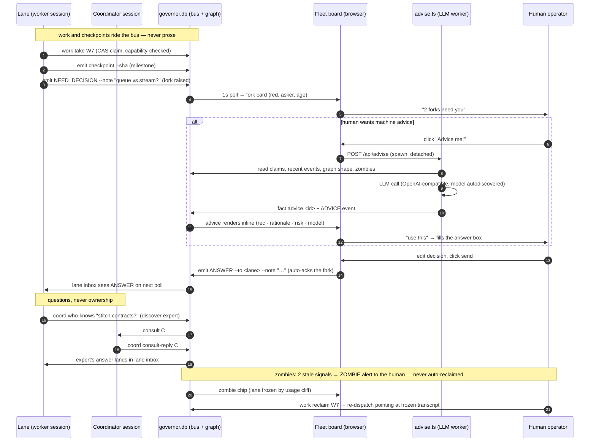

# suspenders

**A governor for agent fleets.** You run five parallel Claude Code sessions; a usage cliff freezes three of them mid-edit; the survivors keep claiming their scopes; nobody notices for six hours. Suspenders is the control plane that notices — and the board where you decide what happens next.

It's the extraction of a harness that has run a real multi-agent fleet for months: a SQLite control plane (claims, locks, events, work graph, sessions) wired into Claude Code's hook system, plus a live web board that turns the bus into a monitoring and task-completion tool — **decision forks with a one-click "Advice me!" LLM recommendation**, per-lane telemetry with zombie detection, project completion stats, and a filterable event stream.


## Why

- **Agents die silently** (usage cliffs, crashes, compaction). Claims and wall clocks keep going. Suspenders detects zombies with two independent signals (heartbeat + transcript mtime) — a lookup failure is *never* death, and nothing is auto-reclaimed; the human decides.
- **Agents collide** — two lanes editing the same file. File-lease governor, scope claims, and capability-aware dispatch refuse work whose requirements the session doesn't advertise.
- **Agents wait instead of work** — a coordinator-mediated handoff costs minutes; a self-claim costs seconds. The session-start hook teaches the self-serve protocol: poll, take, checkpoint.
- **Decisions pile up invisibly** — a lane asks, nothing surfaces. Forks surface on the board; **Advice me!** has an LLM analyze the fork in control-plane context and post a recommendation the human accepts, edits, or dismisses.
- **Markdown ledgers rot.** Operational state lives in the Work Graph, never in Markdown — the graph partitions per project, so one governor.db serves every repo.

## Install

Requires [Bun](https://bun.sh) ≥ 1.1 and Claude Code.

```bash
git clone https://github.com/klh/suspenders && cd suspenders
./install.sh --wire              # + --with-launchd for the macOS agents
```

The installer is idempotent and namespaced (everything under `~/.claude/hooks/suspenders/`), merges the hook wiring per-event without clobbering existing registrations, and prints next steps. Restart Claude Code; then:

```bash
bun ~/.claude/hooks/suspenders/bin/fleet-board.ts   # live board → http://127.0.0.1:7799
bun ~/.claude/hooks/suspenders/bin/work.ts ready    # dispatchable work, per project
bun ~/.claude/hooks/suspenders/bin/monitor.ts       # control-plane health (--fix sweeps safe repairs)
```

Every CLI is also a scriptable API — the board's fork answer box and the monitor are just CLI calls.

## What you get

| Surface | What it does |
|---|---|
| **Control plane** (`lib/govdb.ts`) | SQLite/WAL — sessions, claims, locks, events, facts, cursors, work graph; partitions per project; opens lazily on first hook or CLI call |
| **Hook gates** (`gate.ts`) | One entrypoint: secrets gate (gitleaks + inline secret detection, `cd`-aware), edit-enforce, config guard, file-lease governor, claim-done stop gate |
| **Work graph** (`bin/work.ts`) | `add / split / take / done / ready / mine / orphaned / reclaim / release` — CAS claims, dependency gating, plan-gated fan-out, capability requirements |
| **Coordination bus** (`bin/coord.ts`) | bootstrap, inbox, emit, wait (adaptive backoff), pause/resume with continuation capsules, consults, facts, who-knows |
| **Fleet board** (`bin/fleet-board.ts`) | Live dashboard + the only write endpoints: answer a fork, dismiss, and **Advice me!** (`/api/advise` → `bin/advise.ts`) |
| **Advice worker** (`bin/advise.ts`) | LLM analyzes an unadvised fork in control-plane context; recommendation lands as a fact + `ADVICE` event; the human always sends |
| **Monitor** (`bin/monitor.ts`) | Read-only health; `--fix` sweeps stale sessions/locks; three-state zombie verdicts (ZOMBIE / SUSPECT / UNKNOWN); alerts only the canonical coordinator |
| **Usage windows** (`bin/quota-window.ts`) | Remembers observed 429 resets, predicts the next 5h cliff: exit 0 safe / 1 near cliff / 2 unknown — dispatch defers around it |
| **Progress protocol** (`bin/progress.ts`) | Tiny file-based progress bar; statusline aggregates; the lane-level heartbeat |
| **macOS agents** (`hooks/launchd/`) | 15-min fleet monitor + LLM keepwarm (nonce pings keep MLX weights resident) |

## Architecture

```
Claude Code sessions (n)
  │ SessionStart → bootstrap session, caps, transcript_path, RULES
  │ PreToolUse   → secrets / edit-enforce / governor lease gates
  │ PostToolUse  → syntax check, md format
  │ Stop         → claim-done gate
  ▼
governor.db (SQLite/WAL, ~/.cache/claude-governor/)
  ├── sessions   identity, role, parent, caps, transcript_path, hb
  ├── claims     scope leases + intents
  ├── work_items the Work Graph — per-project partition
  ├── events     the bus — every kind, incl. NEED_DECISION / ANSWER / ADVICE
  ├── facts      latest-value store (advice, zombie flags, coordinator.sid…)
  └── locks      short-lived file leases
  ▲ 1s poll (WAL = concurrent readers)
fleet board — forks · lanes · tasks · stream   ← you, deciding
```

Decision-fork flow: lane emits `NEED_DECISION` → board surfaces it (red card) → optional **Advice me!** spawns `advise.ts` → endpoint-agnostic LLM call (any OpenAI-compatible API; model autodiscovered from `/v1/models`) → recommendation as `advice.<event-id>` fact → human edits/accepts → `ANSWER` event back to the lane. **The LLM advises; the human decides.**

### Messaging, consults, and the human in the loop



## Examples

A full worked session — bootstrap, register work, capability-gated dispatch, consult, fork with advice, human answer, zombie reclaim — lives in [examples/walkthrough.md](examples/walkthrough.md). Every command is copy-pasteable against any repo.

## Security posture

- The control plane never stores credentials; secrets never enter the bus.
- The secrets gate scans every Bash call (gitleaks + inline detection) before execution; runs repo-scoped even across `cd` boundaries.
- The board binds to 127.0.0.1 only; its write endpoints write to the bus as `fleet-board` — a human action, machine-extended.
- `advise.ts` sends fork text + control-plane metadata to the LLM endpoint you configure (local by default). Point `SUSPENDERS_LLM_URL` at a cloud API only if that content may leave the machine.

## Docs

- [Coordination protocol](docs/coordination-protocol.md) — the full binding CLAUDE.md: delta-only output, integration ladder, cooperative preemption, capability dispatch, zombie policy, signalling discipline, usage windows.

## Status

Battle-tested on a months-long multi-repo fleet (macOS + Bun + Claude Code); schema v2. Extracted as suspenders 2026-09-25. MIT.
