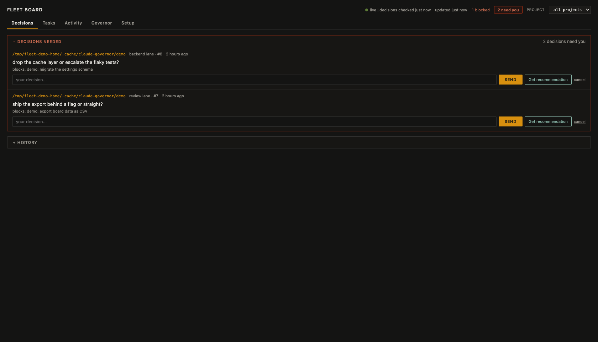
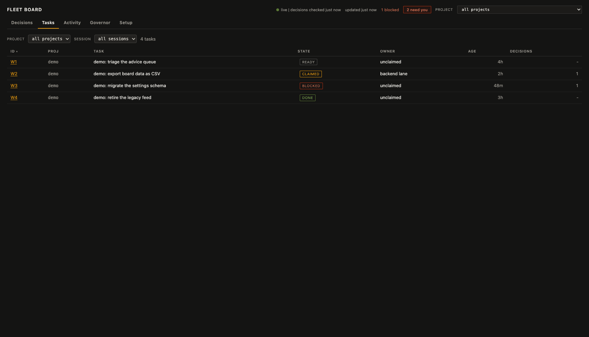
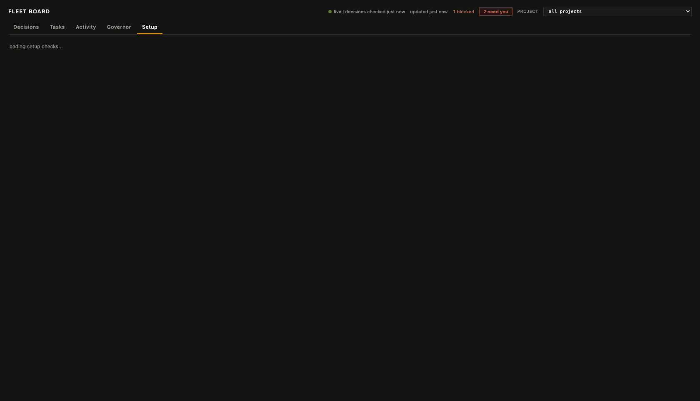

# suspenders

[](https://github.com/klh/suspenders/actions/workflows/ci.yml)
[](https://klh.github.io/suspenders/)

**A control plane and dashboard for fleets of Claude Code sessions.** Run several agents in parallel on one codebase: suspenders tracks who is working on what, refuses conflicting edits, detects dead agents, and puts every question an agent raises on a web board where you can answer it.

Built on a SQLite database (sessions, claims, locks, events, work graph) wired into Claude Code's hook system, plus a live board that shows fleet state at one-second resolution.

|                                                                                                |
| :----------------------------------------------------------------------------------------------------------------------------------------------------- |
| **Decisions** — open questions surface as red cards with the asking agent, the task they block, and an LLM recommendation you can edit before sending. |

|                                              |                                                                   |
| :------------------------------------------------------------------------------------------------- | :---------------------------------------------------------------------------------------------------------------------- |
| **Tasks** — every work item across projects: state, owner, age, and which ones wait on a decision. | **Setup** — installation checks for hook wiring, the monitor agent, and the advice endpoint, each with its fix command. |

## What problem does it solve

- **Agents die** — usage cliffs, crashes, context compaction. Suspenders notices: a session is flagged zombie only when both its heartbeat and its transcript are stale, and nothing is reclaimed without a human decision.
- **Agents collide** — two sessions editing the same file. File leases and scope claims make the second writer wait or get refused; work items can declare required capabilities that a session must advertise before claiming.
- **Questions get lost** — an agent asks something and keeps waiting in the dark. Questions surface as decisions on the board with the asking agent, the task they block, and an optional LLM recommendation you can accept or edit.
- **Knowledge evaporates** — the same question gets answered twice, and the second asker waits on a busy expert anyway. Every answered consult becomes a searchable problem→solution pair; a repeat question resolves instantly, with provenance showing which agent solved it and whether that agent is still running.
- **State lives in chat logs** — suspenders keeps task state in a per-project work graph backed by SQLite, so any session (or a restarted one) sees the same queue, claims, and history.

## Install

Requires [Bun](https://bun.sh) ≥ 1.1 and Claude Code.

```bash
git clone https://github.com/klh/suspenders && cd suspenders
./install.sh --wire --with-launchd   # macOS agents: monitor, keepwarm, board keep-alive, db backups
```

The installer is idempotent and namespaced (everything under `~/.claude/hooks/suspenders/`, wired as seven `settings.json` hook entries), merges hook wiring per-event without clobbering existing registrations, and prints next steps. On machines with [klh-local](https://github.com/klh/local) and Caddy it also registers the board as `suspenders.local` (:7799); without them it prints a hint and moves on. Restart Claude Code; then:

```bash
bun ~/.claude/hooks/suspenders/bin/fleet-board.ts           # live board → http://127.0.0.1:7799
bun ~/.claude/hooks/suspenders/bin/fleet-board.ts --demo    # same board on seeded demo data — try before wiring
bun ~/.claude/hooks/suspenders/bin/work.ts ready            # dispatchable work, per project
bun ~/.claude/hooks/suspenders/bin/monitor.ts               # fleet health (--fix applies safe repairs)
```

Every CLI is also usable from scripts — the board's answer box and the monitor are thin wrappers over the same commands.

## Components

| Surface                                   | What it does                                                                                                                                                                                                                                                                                                                                                                                                                                                                                                                                                                                                                                                                                                                                                                                        |
| ----------------------------------------- | --------------------------------------------------------------------------------------------------------------------------------------------------------------------------------------------------------------------------------------------------------------------------------------------------------------------------------------------------------------------------------------------------------------------------------------------------------------------------------------------------------------------------------------------------------------------------------------------------------------------------------------------------------------------------------------------------------------------------------------------------------------------------------------------------- |
| **Control plane** (`lib/govdb.ts`)        | SQLite/WAL — sessions, claims, locks, events, facts, cursors, work graph; one database serves every repo, partitioned per project                                                                                                                                                                                                                                                                                                                                                                                                                                                                                                                                                                                                                                                                   |
| **Hook gates** (`gate.ts`)                | One entrypoint: secrets gate (gitleaks + inline detection, `cd`-aware), edit-enforce, file-lease governor, mutation-size cap (denies >40-line raw mutations on existing files; `SUSPENDERS_MAX_MUTATION`), operational-ledger marker guard (no new TODO/IN-FLIGHT/BLOCKED/NEXT markers in ledgers), config guard, claim-done stop gate — the Edit/Write gates chain in one process                                                                                                                                                                                                                                                                                                                                                                                                                  |
| **Work graph** (`bin/work.ts`)            | `add / split / take / done / ready / mine / orphaned / reclaim / release / migrate-ledger` — compare-and-swap claims, dependency gating, capability requirements; splits beyond 2 children must reference a registered plan item; every mutation re-exports the project graph to `.workgraph.jsonl` so the queue is committed and fresh clones see it offline (reads fall back to it when the DB cannot serve the project); `migrate-ledger` ingests a Markdown ledger's unresolved items into the graph (deduped, idempotent, tombstones the ledger). Per-item worktrees (`bin/worktree.ts`): `create` isolates a claimed item in `.worktrees/<id>` on `suspenders/<id>` with build dirs symlinked, `done` retires a clean tree and keeps a dirty one — the branch always survives for integration |
| **Coordination bus** (`bin/coord.ts`)     | bootstrap, inbox, emit, wait, pause/resume with continuation capsules, consults, facts, broadcasts, `lease-release`, `metrics` (per-item wall vs agent time, lane dwell, friction — daily snapshot facts for trend diffing), `diff` (deltas read model — see the audit-trail section of the protocol doc)                                                                                                                                                                                                                                                                                                                                                                                                                                                                                           |
| **Consult knowledge base** (`coord kb`)   | `consult-reply` harvests every answered consult as a (problem, solution) pair (FTS5); a new consult resolves against the store **before** routing to a live expert — the asker gets the stored solution instantly, with provenance and an `--no-kb` escape hatch. `kb stats\|search\|list`                                                                                                                                                                                                                                                                                                                                                                                                                                                                                                          |
| **Fleet board** (`bin/fleet-board.ts`)    | Live dashboard — Decisions / Tasks / Activity / Governor / Setup views, project filter, task drawer, decision history; `--demo` seeds example data. Write endpoints for answering decisions, dismissing, and requesting recommendations (`/api/advise` → `bin/advise.ts`); GET `/llms.txt` is the plain-text agent contract — details in [docs/board-api.md](docs/board-api.md) and [docs/decisions-api.md](docs/decisions-api.md)                                                                                                                                                                                                                                                                                                                                                                  |
| **Advice worker** (`bin/advise.ts`)       | An LLM (any OpenAI-compatible API; model autodiscovered from `/v1/models`) reads the decision with control-plane context and writes a recommendation the human can accept, edit, or ignore; an unreachable endpoint degrades gracefully — the fork stays open, the outcome is marked unavailable                                                                                                                                                                                                                                                                                                                                                                                                                                                                                                    |
| **Monitor** (`bin/monitor.ts`)            | Read-only health; `--fix` sweeps stale sessions and locks; four-state verdicts (ZOMBIE / SUSPECT / STALLED / UNKNOWN); alerts the coordinator                                                                                                                                                                                                                                                                                                                                                                                                                                                                                                                                                                                                                                                       |
| **Usage windows** (`bin/quota-window.ts`) | Remembers observed 429 resets and predicts the next 5-hour cliff: exit 0 safe / 1 near cliff / 2 unknown                                                                                                                                                                                                                                                                                                                                                                                                                                                                                                                                                                                                                                                                                            |
| **Progress protocol** (`bin/progress.ts`) | Small file-based progress bar; the statusline aggregates it; doubles as the lane-level heartbeat                                                                                                                                                                                                                                                                                                                                                                                                                                                                                                                                                                                                                                                                                                    |
| **macOS agents** (`hooks/launchd/`)       | Four launchd agents: 15-min fleet monitor, LLM keepwarm, board keep-alive, rolling governor.db backups                                                                                                                                                                                                                                                                                                                                                                                                                                                                                                                                                                                                                                                                                              |

## How a decision resolves

1. A lane needs a call made mid-flight — it emits `NEED_DECISION` instead of blocking silently.
2. The board surfaces it: a red card with the asker, the task it blocks, and its age.
3. Optionally you press **Get recommendation** — the advice worker gathers claims, recent events, and work-graph shape, then asks your configured LLM. A recommendation lands inline (recommendation, rationale, risk, model); one click fills the answer box.
4. You edit and send — the answer goes back to the lane as an `ANSWER` event. Recommendations are suggestions; only you send.
5. The same pipe carries consults between agents — and every answered consult is harvested into the knowledge base, so the next person to ask resolves instantly against the store.

The full message-flow diagram (lanes, coordinator, board, advice worker, zombie reclaim) is rendered at the top of the [project page](https://klh.github.io/suspenders/).

## Architecture

```
Claude Code sessions (n)
  │ SessionStart → register session, capabilities, transcript_path
  │ PreToolUse   → secrets / edit-enforce / file-lease gates
  │ PostToolUse  → syntax check, md format
  │ Stop         → claim-done gate
  ▼
governor.db (SQLite/WAL, ~/.cache/claude-governor/)
  ├── sessions   identity, role, parent, caps, transcript_path, hb
  ├── claims     scope leases + intents
  ├── work_items the work graph — per-project partition
  ├── events     every event kind, incl. NEED_DECISION / ANSWER / ADVICE
  ├── facts      latest-value store (advice, zombie flags, coordinator id…)
  └── locks      short-lived file leases
  ▲ 1s poll (WAL = concurrent readers)
fleet board — decisions · tasks · activity · governor · setup
```

Every work-graph mutation mirrors the project graph to `.workgraph.jsonl` — the queue is committed to git, and fresh clones read it offline when the database cannot serve the project.

## Examples

A worked session — bootstrap, register work, capability-gated dispatch, consult, decision with recommendation, answer, zombie reclaim — lives in [examples/walkthrough.md](examples/walkthrough.md). Every command is copy-pasteable against any repo.

## Companion repos

| Repo                                            | Role in the fleet                                                                           |
| ----------------------------------------------- | ------------------------------------------------------------------------------------------- |
| [suspenders](https://github.com/klh/suspenders) | This repo — the agent control plane: hooks, work graph, coord bus, fleet board              |
| [belt](https://github.com/klh/belt)             | The LLM fleet — local OpenAI-compatible endpoints; default advice endpoint (`:8901`)        |
| [klh-local](https://github.com/klh/local)       | LAN serving — user-level Caddy fronting `suspenders.local` (:7799) and `belt.local` (:7791) |

## Security

- The database stores no credentials; the secrets gate scans every Bash call (gitleaks + inline detection) before execution, repo-scoped even across `cd` boundaries.
- The board binds to 127.0.0.1 only. LAN exposure is opt-in via `SUSPENDERS_BIND=0.0.0.0` (for example to reach it as `suspenders.local` behind a local reverse proxy). Write endpoints require a same-origin request from a browser, or a loopback Host for CLI clients.
- `advise.ts` sends decision text and control-plane metadata to the LLM endpoint you configure (local by default). Point `SUSPENDERS_LLM_URL` at a cloud API only if that content may leave the machine.

## Docs

- [Coordination protocol](docs/coordination-protocol.md) — a copy-paste CLAUDE.md section for a multi-agent repo: reporting discipline, integration steps, pause/resume, capability dispatch, zombie policy, usage windows, audit trail (`coord diff`), workgraph mirror.
- [Board API](docs/board-api.md) — the board's HTTP surface (read endpoints, write endpoints, demo mode).
- [Decisions API](docs/decisions-api.md) — the decisions surface: events, advise routing, ack semantics.

## Status

In production on a multi-repo fleet (macOS + Bun + Claude Code); schema v5. [speedy-claude](https://github.com/klh/speedy-claude) installs suspenders as its control plane.

## Licensing

suspenders is source-available under the **Business Source License 1.1** (see [LICENSE](LICENSE)):

- **Free** for personal projects, education, research, and internal evaluation.
- **Production / commercial use requires a commercial license** — running it in a product or service, in paid client work, or as part of business operations. Contact the Licensor (see LICENSE) for terms.
- **No conversion** — unlike standard BSL 1.1, the Change Date / Change License parameters are **N/A**: the Licensed Work never converts to an open license; all rights remain with the Licensor indefinitely.

A Threads thing — [threads.dk](http://www.threads.dk).
