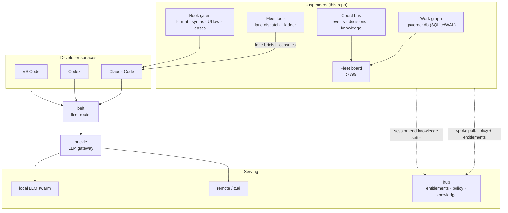

# suspenders

The control plane for agent fleets: a SQLite work graph, a coordination
bus, a live fleet board, and hook gates that keep autonomous lanes honest.
The spine of the [klh agent stack](https://github.com/klh/suspenders) —
[buckle](https://github.com/klh/buckle) is its gateway, belt its router,
klh/local the LAN fabric, speedy the installer.


```mermaid
flowchart TB
    subgraph surfaces[Developer surfaces]
        CC[Claude Code]
        CX[Codex]
        VS[VS Code]
    end
    subgraph suspenders["suspenders (this repo)"]
        WG["Work graph<br/>governor.db (SQLite/WAL)"]
        CB["Coord bus<br/>events · decisions · knowledge"]
        FB["Fleet board<br/>:7799"]
        HG["Hook gates<br/>format · syntax · UI law · leases"]
        FL["Fleet loop<br/>lane dispatch + ladder"]
    end
    BT["belt<br/>fleet router"]
    BK["buckle<br/>LLM gateway"]
    subgraph serving["Serving"]
        SW["local LLM swarm"]
        REM["remote / z.ai"]
        HUB["hub<br/>entitlements · policy · knowledge"]
    end
    CC & CX & VS --> BT
    BT --> BK
    BK --> SW
    BK --> REM
    FL -->|"lane briefs + capsules"| CC
    WG --> FB
    CB --> FB
    HG --> CC
    suspenders -.->|"spoke pull: policy + entitlements"| HUB
    suspenders -.->|"session-end knowledge settle"| HUB
```

## What's inside

- **Work graph** — hierarchical, shatterable items (`work add / split /
done`), claims, dependency edges, lifecycle verbs (unclaim, cancel,
  reassign, second-opinion), capsule handoff so any lane can resume on
  another brain.
- **Coord bus** — questions-over-ownership (`consult`, `who-knows`),
  decision forks surfaced to the human (`NEED_DECISION`), facts and
  lessons as the fleet's durable memory, knowledge harvest from lane
  transcripts.
- **Fleet board** — live SPA over the graph: decisions with LLM
  recommendations (user-configurable model), tasks with executor
  preferences and dependency state, lanes, usage attribution per
  actor/model, governor backpressure view.
- **Hook gates** — every write passes format (qlty/biome/prettier),
  syntax, size, UI-law (never `innerHTML`), and lease checks; the
  1500-line hard limit is enforced on-save.
- **Fleet loop** — dispatches READY items as worktree lanes with
  capsule briefs, runs the merge ladder, watches liveness.
- **Federation** — hub + spokes: entitlements echo, spoke-pull policy,
  change-request channel, hub-only signing keys, ML-KEM (PQC) wire.

## Quick start

```sh
bun install
bun test
bun hooks/bin/fleet-board.ts            # the board
bun hooks/bin/work.ts list              # the graph
bun hooks/bin/coord.ts fleet            # who is working
```

## Repo law

- One ledger: todos live on the work graph, never scattered in repos.
- `CLAUDE.md` files are law for lanes: streams over buffers, Lit for UI
  (never `innerHTML`), 1500-line hard limit, qlty quality gates.
- Config over code: machine facts ride `~/.claude/local-llm/*.json`
  (never committed); repos carry placeholders only.

License: see [LICENSE](LICENSE).
